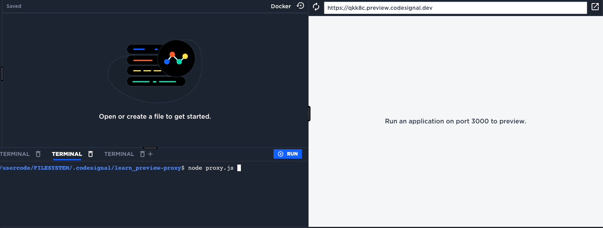

# Preview Proxy

A simple proxy server that shows a loading page until the target application is ready.



## Features

- Shows a customizable loading page until the target application signals readiness
- Proxies all requests to a target port once ready
- Configurable redirect path when application is ready
- Customizable loading screen messages

## Usage

```bash
npm install
node proxy.js [options]
```

### Options

- `--server-port <port>`: Set the port for the proxy server (default: 3000)
- `--proxy-port <port>`: Set the port for the target application (default: 3001)
- `--redirect-path <path>`: Set the path to redirect to when the application is ready (default: "/")
- `--heading-message <text>`: Set the heading text for the loading page (default: "Loading Application")
- `--subheading-message <text>`: Set the subheading text for the loading page (default: "Please wait while we initialize your session...")
- `is-ready`: Start in the ready state and skip the loading page

### Installing Node.js
Some environments require installing Node.js manually.  Use the `install_node.sh` script to install the correct version of Node.js for this project. It will start by installing `nvm` and then installs Node.js.

### A common scenario:
To use this proxy, simply clone the repo, install Node.js if necessary, and start the proxy.

```bash
git clone --depth 1 --branch v0.0.1 https://github.com/codesignal/learn_preview-proxy.git  > /dev/null 2>&1
cd learn_preview-proxy
bash ./install_node.sh
source ~/.bashrc
node proxy.js
```


